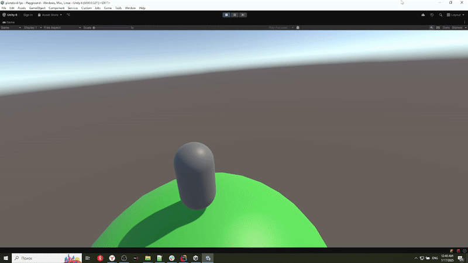

# Hot Planet (Work‑in‑Progress)

A small Unity project demonstrating custom surface gravity, 3rd‑person movement & camera, and foundational infrastructure. 3rd-person shooter in future.

## 🎮 What’s Here

- **Core Mechanics**
    - Custom surface gravity (mesh‑based normals)
    - Smooth 3rd‑person platformer a-like controller (variable‑height jumps, air control)

- **Infrastructure**
    - Bootstrap & loading flow
    - Window system
    - DI via Zenject, reactive programming via UniRx
    - Module with the basis of client-server interaction and implementation in Fishnet. See demo for basic client-server message exchange and RPC in `Demos/NetworkingDemo`.

## 🚀 Getting Started

1. Clone this repo
2. Open in Unity 6+
3. Hit **Game->Play** in the Toolbar

## 🛠 Tech Stack

- Unity 6 (LTS)
- Zenject
- UniRx
- Addressables (in future)
- FishNet

## 📈 Main Goals Roadmap

- [ ] Networked multiplayer with authoritative server
- [ ] Player spawn system
- [ ] Damage and Weapon systems, HUD
- [ ] Backend for authentication, player profiles, lobbies
- [ ] Character & weapon animations
- [ ] UI, Settings
- [ ] Audio & SFX
- [ ] Art & VFX
- [ ] Input remapping & accessibility options
- [ ] Performance profiling & optimization
- [ ] Automated tests & CI/CD pipeline
- [ ] Analytics / telemetry framework
- [ ] Localization support
- [ ] Tutorial / onboarding flow
- [ ] Release a minimal MVP build

## 🗣 About Me

This is an early, in‑development prototype - my personal rewrite of Hot Planet game (https://youtu.be/uvDixcYVbT8) I've made long time ago. 
I’m actively iterating on it to shape a standalone MVP I can release.

